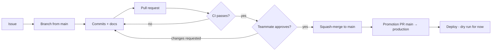

# Workflow

**In short:** log an issue, start from an up-to-date `main`, work on a named branch, update the docs, open a pull request, pass CI, get a teammate's approval, and squash-merge. Releases happen by promoting `main` to `production`.



## 1. Start clean

Before any new task, in the repository you are about to work in:

```
git switch main
git fetch --prune
git pull --ff-only
```

Then delete **local** branches whose pull requests have merged. Never delete `main`, `production`, or any `review/*` branch.

```
gh pr list --state merged --limit 200 --json headRefName --jq ".[].headRefName"
```

For each branch name in that list that still exists locally (and is not protected), run `git branch -D <branch>`. `-D` is needed because squash merges do not look merged to git. Remote branches are deleted automatically by GitHub when their PR merges.

## 2. Start from an issue

Basing work on a logged issue is strongly encouraged. Use the matching template ([issues and PRs](issues-and-prs.md)). If the work spans both application repositories, file one issue in each and link them.

### Project board

All issues from every repository are tracked on the organization's project board, with the columns **To do → In progress → In review → Done**.
- New issues are added to the board and start in **To do**.
- Assign yourself and move the card to **In progress** when you start the branch.
- The card moves to **In review** when the PR is opened, and to **Done** when it merges and closes the issue.

## 3. Branch

```
git switch -c feat/14-time-off-requests
```

Format: `<type>/<issue#>-<slug>` ([naming conventions](naming-conventions.md)). One branch per topic; if you find a second, unrelated change to make, give it its own issue and branch.

## 4. Commit

Small, focused commits in the title format. The commit-message hook adds `Refs #14` from the branch name when you leave it out.

```
feat(time-off): add request model and migration

Refs #14
```

## 5. Update documentation

In the same branch, update every document the change affects ([documentation](documentation.md)). CI warns when code changes without any documentation change.

## 6. Check locally and push

```
python ../.github/scripts/ci_runner.py
git push -u origin feat/14-time-off-requests
```

## 7. Open the pull request

Use the template; fill in *Summary* and *What changed* in plain language first, then the *Details*. Mark it as a draft if it is not ready; drafts are left out of `review/integration`.

```
gh pr create --base main --fill-first   # then edit the body using the template
```

CI runs and posts one report comment that updates on every push ([CI](ci.md)).

## 8. Review and merge

- The teammate reviews and approves. New commits dismiss earlier approvals.
- All required checks must pass, and the branch must be up to date with `main`.
- Merge with **Squash and merge**. The squash commit uses the PR title and description.
- GitHub deletes the remote branch; delete your local copy at the start of your next task.

## 9. Promote to production

When `main` is ready to release, open a pull request from `main` into `production`:

- Title: `chore(release): promote main to production`
- Body: a `## Summary` listing the PRs included.
- Merge with **Create a merge commit** (never squash), so `production` and `main` share history and the next promotion only shows new changes.

There is no `staging` branch.

## Fixing something urgent

Use a normal `fix/*` branch into `main`, then promote. In a true emergency, see the bypass rules in [CI](ci.md#emergency-merges).
