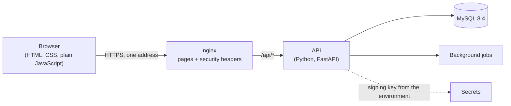

# Design overview: start here

**In short:** the Workforce Operations Application lets companies schedule shifts, handle time off and shift swaps, assign shift tasks, and post announcements, while keeping each company's data strictly separate and every sensitive action on record. This page explains the whole design in a few minutes and says what to read next for each part. The plan and current status are in the pinned [Roadmap](https://github.com/workforce-ops-app/.github/issues/24).

## What it does

| Tier | Features | Target |
|---|---|---|
| **Core** | sign-in and sessions; company structure, people, roles, and reporting lines; schedules; time off; audit log entries; demo data | midterm demo |
| **Next** | coverage and swaps; draft-and-publish schedules; shift tasks with photos (the secure file upload feature); announcements; notifications; company settings and logo; audit viewer; security page and detection; backups | final demo |
| **Stretch** | extra safeguards for sensitive actions, two-factor sign-in, email notifications, hosting, platform support access, and more | if time allows |

Details: [decision 0023](../decisions/0023-feature-tiers-and-audit-schedule.md).

## The system in one picture

- **Two application repositories:** [backend](https://github.com/workforce-ops-app/workforce-ops-backend) and [frontend](https://github.com/workforce-ops-app/workforce-ops-frontend), plus this repository for what they share ([0002](../decisions/0002-repository-layout.md)).
- **One address for pages and API**, so the session cookie can be locked down tightly ([0003](../decisions/0003-same-origin-deployment.md)).
- **The backend is split by feature** (`app/modules/<feature>/`), with shared security layers every feature plugs into ([0004](../decisions/0004-backend-feature-modules.md), [0012](../decisions/0012-extensibility-patterns.md)).
- **The frontend is plain multi-page JavaScript** with no framework; all server calls go through one layer ([0005](../decisions/0005-frontend-multi-page-vanilla-js.md)).

## The security model in brief

1. **Companies are kept apart** by four independent layers: an automatic company filter on every query, database links that include the company, tests that try to cross between companies, and "not found" answers for other companies' data ([0016](../decisions/0016-tenant-isolation.md)).
2. **Who may do what** comes from roles, each assigned with a **scope** (company, department, team, or one person). **Reporting lines** decide who is above whom: acting on a person needs both the permission and a position above them ([0017](../decisions/0017-scoped-role-assignments.md), [0024](../decisions/0024-authorization-model.md)).
3. **Access is handed down from the owner.** Nobody grants more than they hold or changes their own access; giving someone a role at your own level, owner changes, and changes to your own account need approval from above ([0032](../decisions/0032-delegation-limits.md)).
4. **Sign-in** uses long passwords stored with Argon2id, server-side sessions in a locked-down cookie, protection against forged requests, short escalating lockouts, and password re-entry before risky actions ([0027](../decisions/0027-authentication-and-sessions.md), [0025](../decisions/0025-sensitive-actions-and-security-settings.md)).
5. **A tamper-evident audit log** records every security-relevant action in a chain signed with a key kept outside the database ([0018](../decisions/0018-audit-log-chains.md)).
6. **Nothing is deleted**: records are deactivated, archived, or cancelled, so history stays complete ([0020](../decisions/0020-status-over-deletion.md)).
7. **Safe by construction:** database access only through parameterized queries ([0022](../decisions/0022-sqlalchemy-and-alembic.md)); user text only ever shown as text, with a strict Content Security Policy (0005).

Everything that could go wrong, and what answers it, is in the [threat model](https://github.com/workforce-ops-app/workforce-ops-backend/blob/main/docs/security/threat-model.md).

## Reading order

Start with this page, then the [project overview](README.md) (courses, deliverables, how we work), then the area you are working on:

| Area | Decisions | Design pages |
|---|---|---|
| Keeping companies apart | [0016](../decisions/0016-tenant-isolation.md) | [tenancy](https://github.com/workforce-ops-app/workforce-ops-backend/blob/main/docs/architecture/tenancy.md), [data model](https://github.com/workforce-ops-app/workforce-ops-backend/blob/main/docs/architecture/data-model.md) |
| Permissions, roles, reporting lines | [0017](../decisions/0017-scoped-role-assignments.md), [0024](../decisions/0024-authorization-model.md), [0032](../decisions/0032-delegation-limits.md) | [authorization](https://github.com/workforce-ops-app/workforce-ops-backend/blob/main/docs/architecture/authorization.md) |
| Sign-in and sessions | [0027](../decisions/0027-authentication-and-sessions.md), [0025](../decisions/0025-sensitive-actions-and-security-settings.md) | [authentication](https://github.com/workforce-ops-app/workforce-ops-backend/blob/main/docs/architecture/authentication.md) |
| Audit log | [0018](../decisions/0018-audit-log-chains.md) | [audit log](https://github.com/workforce-ops-app/workforce-ops-backend/blob/main/docs/architecture/audit-log.md) |
| Data, IDs, time | [0019](../decisions/0019-uuidv7-ids.md), [0020](../decisions/0020-status-over-deletion.md), [0021](../decisions/0021-time-handling.md), [0022](../decisions/0022-sqlalchemy-and-alembic.md) | [data model](https://github.com/workforce-ops-app/workforce-ops-backend/blob/main/docs/architecture/data-model.md), [glossary](https://github.com/workforce-ops-app/workforce-ops-backend/blob/main/docs/architecture/glossary.md) |
| API conventions | [0026](../decisions/0026-api-conventions.md), [0003](../decisions/0003-same-origin-deployment.md) | [API user docs](https://github.com/workforce-ops-app/workforce-ops-backend/blob/main/docs/user/README.md) |
| Core features | [0023](../decisions/0023-feature-tiers-and-audit-schedule.md), [0029](../decisions/0029-request-approval-routing.md) | backend: [company structure](https://github.com/workforce-ops-app/workforce-ops-backend/blob/main/docs/features/organization.md), [schedules](https://github.com/workforce-ops-app/workforce-ops-backend/blob/main/docs/features/schedules.md), [time off](https://github.com/workforce-ops-app/workforce-ops-backend/blob/main/docs/features/time-off.md); frontend: [screens](https://github.com/workforce-ops-app/workforce-ops-frontend/blob/main/docs/features/README.md) |
| Security study and report | [0030](../decisions/0030-security-study-method.md) | [threat model](https://github.com/workforce-ops-app/workforce-ops-backend/blob/main/docs/security/threat-model.md), [report plan](report-plan.md) |
| Demos and environment | [0031](../decisions/0031-demo-environment-and-data.md), [0010](../decisions/0010-runtime-versions.md) | [local setup](../contributing/local-setup.md) |
| How we work | [0006](../decisions/0006-branching-and-promotion.md) to [0009](../decisions/0009-ci-bypass-policy.md), [0013](../decisions/0013-documentation-structure.md) | [contributor guide](../contributing/README.md), especially [workflow](../contributing/workflow.md) and [issues and pull requests](../contributing/issues-and-prs.md) |

The full list of decisions is in the [decision records](../decisions/README.md); the discussion behind them is kept in the closed [design review sign-off](https://github.com/workforce-ops-app/.github/issues/17).

## Where to find the plan

- **The [Roadmap](https://github.com/workforce-ops-app/.github/issues/24)** (pinned): the phases from design to the final demo, what each must prove before the next starts, and the current status.
- **Each phase and larger feature has a tracker issue** listing its small pieces of work; pick the next open one whose dependencies have merged ([slices and trackers](../contributing/issues-and-prs.md#slices-and-tracker-issues)).
- **Each repository has a project board** (Backlog, Ready, In progress, In review, Done) showing who is working on what ([workflow](../contributing/workflow.md#project-board)).
- **Every change** goes through a pull request approved by the other teammate ([workflow](../contributing/workflow.md)).
